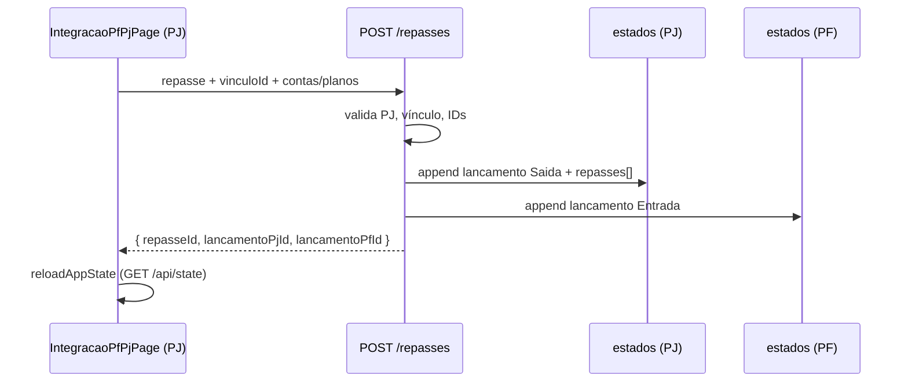

# Integração PF/PJ — Plano técnico (Fluxiva)

Documento de referência para implementação. **Etapa 5.0B implementada (vínculo único).**

Repositório: https://github.com/tecnocell-cell/gestorfinanceiro

---

## Escopo 5.0 (revisado — Etapa 5.0A)

**Mensagem comercial:** “Você possui uma conta PF conosco? Vincule aqui.”

| Incluído (5.0B) | Fora de escopo (futuro) |
|-----------------|-------------------------|
| 1 PF por PJ (`UNIQUE` parcial SQL) | Múltiplas PFs por PJ |
| Convite por e-mail + aceite/recusa PF | Pró-labore, salário, repasses |
| Tabela `integracao_pf_pj_vinculo` | Lançamentos espelhados |
| UI PJ + card em Perfil PF | Funcionário, prestador, sócio (papéis) |
| Rotas `/api/integracao-pf-pj/*` | Rollback de repasses |

---

## Objetivo

Permitir que uma conta **Pessoa Jurídica (PJ)** vincule uma ou mais **Pessoas Físicas (PF)** e automatize repasses contábeis (pró-labore, salário, distribuição de lucros, reembolso, adiantamento), criando **dois lançamentos espelhados e rastreáveis** — um na PJ (saída) e outro na PF (entrada).

**Princípio:** PF e PJ continuam **totalmente separadas**. A integração apenas espelha lançamentos com metadados de vínculo; não mistura dados nem estados.

---

## Regras obrigatórias (não negociáveis)

- Não alterar autenticação nem JWT.
- Não alterar backend sem necessidade comprovada.
- Não criar migrations SQL sem explicar e aprovar antes.
- Não quebrar `GET/PUT /api/state` (apenas campos aditivos).
- Não alterar contratos existentes de API.
- Não remover funcionalidades atuais.
- Não misturar dados PF e PJ no mesmo tenant.
- Admin impersonation permanece **read-only**.

---

## Situação atual do projeto (baseline)

### Modelo de tenant

| Conceito | Implementação |
|----------|---------------|
| Tenant | 1 linha em `usuarios` = 1 cliente |
| Dados financeiros | 1 JSONB em `estados.dados` por `usuario_id` |
| Tipo PF/PJ | Coluna `usuarios.tipo_perfil`: `"fisica"` \| `"juridica"` |
| Isolamento | JWT → `req.user.id`; todo `PUT /api/state` grava só no próprio tenant |

### Estrutura JSONB (`estados.dados`)

```javascript
{
  empresas: [{
    id, nome, tipo,                    // "fisica" | "juridica"
    company?, pessoa?,
    contas[], planoContas[], lancamentos[],
    clientes[], fornecedores[],        // PJ
    fechamentos[], metas[], orcamentos[]
  }],
  empresaAtivaId: string,
  filterPeriodo: { ano, mes }
}
```

### Diferenças PF vs PJ

| Aspecto | PF | PJ |
|--------|----|----|
| Identidade | `pessoa` | `company` |
| Plano | Categorias (`planoContas`) | Plano contábil completo |
| Labels UI | Receita / Despesa | Entrada / Saída |
| Menu | `NAV_ITEMS_FISICA` (12 itens) | `NAV_ITEMS` (18 itens) |

### Arquivos centrais hoje

| Responsabilidade | Arquivo |
|------------------|---------|
| Estado React + CRUD | `src/gestor/GestorContext.jsx` |
| Factories PF/PJ (client) | `src/gestor/storage.js` |
| Normalização PF/PJ (client) | `src/gestor/storage.js` → `normalizeStateForUser` |
| Factories + normalização (server) | `server/initialState.js` |
| Persistência | `server/index.js` → `GET/PUT /api/state` |
| Rotas UI | `src/gestor/GestorApp.jsx`, `src/gestor/constants.js` |
| Criação de lançamentos (UI) | `src/gestor/components/Modals.jsx` → `saveLancamento` |
| Escrita server-side em JSONB | `server/whatsapp/lancamentoWriter.js` *(precedente útil)* |

### Como lançamentos são criados hoje

1. **UI:** `openModal("lancamento")` → `ModalLancamento` → `saveLancamento()` → `lancCrud.add()` → debounce → `PUT /api/state`.
2. **Recorrências:** `lancCrud.add()` no client; SQL só avança `proxima_data`.
3. **WhatsApp:** `lancamentoWriter.js` escreve JSONB direto no server.

Campos típicos de um lançamento:

```javascript
{
  id, codigo, lote,
  data, vencimento?, tipo,           // "Entrada" | "Saida" | "Transferencia"
  valor, historico,
  planoId, contaEntradaId, contaSaidaId,
  codigoDestino, codigoOrigem,
  status?, pago?, consiliado?,
  recorrenciaId?, source?, createdAt?
}
```

### Conclusão crítica

**Uma PJ logada NÃO consegue hoje criar lançamento na PF vinculada.**

- `lancCrud` e `PUT /api/state` operam exclusivamente no JSONB do usuário autenticado.
- Não existe endpoint para usuário comum buscar PF por e-mail.
- Admin impersonation é read-only (`PUT /api/admin/users/:id/state` → 403).

**Backend dedicado é inevitável a partir da Fase 2** (padrão similar a `lancamentoWriter.js`).

---

## Conceito funcional

### Menu (PJ)

Novo item no menu PJ:

**Integrações PF/PJ**

Não adicionar no menu PF na v1 (opcional depois: filtro read-only “Recebimentos vinculados” em Lançamentos).

### 1. Pessoas vinculadas

A PJ pode vincular várias PFs. Cada vínculo:

| Campo | Tipo | Descrição |
|-------|------|-----------|
| `id` | uuid | Identificador do vínculo |
| `nome` | string | Nome exibido |
| `email` | string | E-mail da PF (lookup) |
| `usuarioPfId` | uuid | ID em `usuarios` (obrigatório após validação server) |
| `tipo` | enum | `socio`, `funcionario`, `prestador`, `outro` |
| `contaPfEntradaIdPadrao` | string | Conta PF default para entradas |
| `categoriaPfEntradaIdPadrao` | string | Categoria/plano PF default |
| `ativo` | boolean | Vínculo ativo |
| `createdAt` | ISO string | Data de criação |

### 2. Tipos de repasse (v1)

- Pró-labore
- Salário
- Distribuição de lucros
- Reembolso
- Adiantamento
- Outro

### 3. Novo repasse (formulário)

Campos:

- Pessoa vinculada
- Tipo de repasse
- Valor
- Data
- Conta PJ de saída
- Categoria/plano PJ de saída
- Conta PF de entrada
- Categoria PF de entrada
- Histórico
- Observação

**Ao salvar**, criar dois lançamentos:

| Lado | Tipo | Exemplo histórico |
|------|------|-------------------|
| PJ | `Saida` | "Pró-labore para Gianderson" |
| PF | `Entrada` | "Pró-labore recebido de Empresa X" |

Ambos com metadados `integracaoPfPj` (ver estrutura abaixo).

### Escopo v1 (explicitamente fora)

- Edição sincronizada de repasse
- Exclusão sincronizada (apenas aviso se existir par)
- Recorrência automática de repasses
- Consentimento/aceite formal da PF

---

## Proposta de estrutura de dados

### Container no JSONB da PJ (recomendado: dentro da empresa ativa)

```javascript
empresa.integracaoPfPj = {
  vinculos: [ /* ... */ ],
  repasses: [ /* histórico */ ]
}
```

`normalizeStateForUser` preserva campos extras via spread (`{ ...emp, ... }`).

### Log de repasse (PJ)

```javascript
{
  id: "uuid-repasse",
  vinculoId: "uuid",
  tipo: "prolabore",
  valor: 5000.00,
  data: "2026-05-31",
  historico: "Pró-labore maio",
  observacao: "",
  lancamentoPjId: "id-pj",
  lancamentoPfId: "id-pf",
  contaPjSaidaId: "c2",
  planoPjId: "p3",
  contaPfEntradaId: "c2",
  planoPfId: "cf1",
  status: "ok",
  criadoEm: "2026-05-31T12:00:00.000Z"
}
```

### Metadados no lançamento (PJ e PF)

```javascript
integracaoPfPj: {
  id: "uuid-repasse",
  tipo: "prolabore",
  lado: "pj" | "pf",
  lancamentoParId: "id-do-outro-lado",
  perfilOrigemId: "uuid-usuario-pj",
  perfilDestinoId: "uuid-usuario-pf",
  vinculoId: "uuid",
  criadoEm: "2026-05-31T12:00:00.000Z"
}
```

---

## JSONB vs tabela SQL

### v1 — sem migration (recomendado)

| Dado | Onde |
|------|------|
| Vínculos | JSONB PJ (`integracaoPfPj.vinculos`) |
| Histórico repasses | JSONB PJ (`integracaoPfPj.repasses`) |
| Rastreabilidade | `integracaoPfPj` em cada lançamento |
| Lookup PF por e-mail | Query pontual no endpoint (não expor lista) |

### Migration futura (só se necessário)

Considerar tabela SQL (`integracao_vinculos`, `integracao_repasses`) se precisar de:

- Auditoria independente do JSONB
- Idempotência forte (`UNIQUE(repasse_id)`)
- Relatórios cross-tenant
- Fluxo de consentimento PF (vínculo bidirecional)

Padrão existente de referência: `server/migrations/003_recorrencias.sql`.

**Aprovar migration antes de criar.**

---

## Endpoints propostos (novos, sem alterar auth/JWT)

### Fase 1

```
GET /api/integracao-pf-pj/buscar-pf?email=
```

- Auth: JWT usuário PJ (`tipo_perfil = juridica`).
- Retorna `{ id, nome, email }` se PF existir e estiver ativa.
- Não expor lista completa de usuários.

### Fase 2

```
POST /api/integracao-pf-pj/repasses
```

Body exemplo:

```javascript
{
  vinculoId, tipo, valor, data, historico, observacao,
  contaPjSaidaId, planoPjId,
  contaPfEntradaId, planoPfId
}
```

Fluxo server (atômico):

1. Validar JWT = PJ.
2. Validar vínculo ativo (`usuarioPfId`).
3. Validar contas/planos nos dois JSONBs.
4. Criar lançamento **Saída** no JSONB da PJ.
5. Criar lançamento **Entrada** no JSONB da PF.
6. Gravar `integracaoPfPj` nos dois lançamentos.
7. Append em `repasses[]` na PJ.
8. Retornar `{ repasseId, lancamentoPjId, lancamentoPfId }`.

Client após sucesso: `reloadAppState()` (GET `/api/state`).

---

## Diagrama de fluxo (Fase 2)



---

## Tela Integrações PF/PJ (UX)

Layout premium (padrão `.pp-*` atual):

- Header com título + subtítulo explicando separação PF/PJ
- Cards resumo: PFs vinculadas, Repasses no mês, Total repassado, Último repasse
- Aba **Pessoas vinculadas**
- Aba **Histórico de repasses**
- Botão **Novo repasse**
- Botão **Vincular pessoa física**

Mensagens claras:

- PF e PJ são contas separadas
- O sistema automatiza os dois lançamentos
- Status do vínculo e origem/destino visíveis no histórico

---

## Plano de implementação por fases

### FASE 1 — Base visual + vínculos (sem lançamento)

| # | Tarefa |
|---|--------|
| 1.1 | Item menu PJ `integracao-pf-pj` em `constants.js` |
| 1.2 | Rota em `GestorApp.jsx` |
| 1.3 | Página `IntegracaoPfPjPage.jsx` (premium) |
| 1.4 | Default `integracaoPfPj` em `storage.js` + `initialState.js` (PJ) |
| 1.5 | CRUD vínculos via `patchEmpresa` → `PUT /api/state` |
| 1.6 | Endpoint `GET buscar-pf?email=` |
| 1.7 | Modal vincular PF |

**Entregável:** PJ cadastra vínculos; persiste após refresh. Zero impacto em lançamentos.

---

### FASE 2 — Novo repasse

| # | Tarefa |
|---|--------|
| 2.1 | Formulário completo de repasse |
| 2.2 | `server/integracaoPfPj/repasseWriter.js` |
| 2.3 | `POST /api/integracao-pf-pj/repasses` |
| 2.4 | `criarRepassePfPj()` no context ou hook |
| 2.5 | Metadados `integracaoPfPj` nos dois lançamentos |

**Entregável:** 1 repasse → saída PJ + entrada PF rastreáveis.

---

### FASE 3 — Histórico

| # | Tarefa |
|---|--------|
| 3.1 | Lista de repasses com status |
| 3.2 | Cards resumo calculados |
| 3.3 | Link visual para lançamento PJ |
| 3.4 | (Opcional PF) Filtro read-only em Lançamentos |

---

### FASE 4 — Segurança

| # | Tarefa |
|---|--------|
| 4.1 | Validar valor > 0, contas/planos ativos |
| 4.2 | Bloquear repasse em `viewOnly` |
| 4.3 | Aviso ao excluir lançamento com par vinculado |
| 4.4 | Idempotência / anti-duplicidade |
| 4.5 | Transação atômica (rollback se PF falhar) |

---

### FASE 5 — Build e testes

```bash
npm run build
```

Checklist manual:

- [ ] PJ vincula múltiplas PFs
- [ ] Repasse não aparece na PF errada
- [ ] Lançamento PJ = Saída; PF = Entrada
- [ ] Metadados bidirecionais nos dois lados
- [ ] Dashboard e lançamentos atualizam
- [ ] PF/PJ comum intactos (sem integração)
- [ ] Persistência após refresh
- [ ] Build passa

---

## Arquivos previstos para alteração

### Fase 1

| Arquivo | Alteração |
|---------|-----------|
| `src/gestor/constants.js` | Nav item PJ |
| `src/gestor/components/icons.jsx` | Ícone menu |
| `src/gestor/GestorApp.jsx` | Rota + page map |
| `src/gestor/pages/IntegracaoPfPjPage.jsx` | **Novo** |
| `src/gestor/GestorContext.jsx` | CRUD vínculos |
| `src/gestor/storage.js` | Default JSONB |
| `server/initialState.js` | Default JSONB (server) |
| `src/gestor/styles.js` | Estilos se necessário |
| `src/gestor/components/Modals.jsx` | Modal vincular |
| `src/gestor/api.js` | Cliente API |
| `server/index.js` | Endpoint buscar PF |

### Fase 2+

| Arquivo | Alteração |
|---------|-----------|
| `server/integracaoPfPj/repasseWriter.js` | **Novo** |
| `server/index.js` | POST repasses |
| `src/gestor/finance.js` | Helpers validação (opcional) |
| `src/gestor/pages/Pages.jsx` | Aviso exclusão (opcional) |
| `src/gestor/pages/PagesPF.jsx` | Filtro vinculados (opcional) |

### Não alterar

- `server/middleware/auth.js` (JWT)
- Contrato `GET/PUT /api/state` (só campos aditivos)
- Fluxos PF/PJ existentes sem integração

---

## Riscos e mitigações

| Risco | Severidade | Mitigação |
|-------|------------|-----------|
| Escrita parcial (PJ ok, PF falha) | Alta | Transação server; rollback |
| Repasse duplicado | Média | Idempotency key / checagem |
| PF errada | Alta | Validar `usuarioPfId` no vínculo ativo |
| IDs conta/categoria inválidos | Média | Validar no JSONB de cada tenant |
| Race condition (saves simultâneos) | Média | Endpoint atômico único |
| Exclusão de um lado do par | Média | v1: aviso; v2: sync |
| Privacidade (busca e-mail) | Média | Retorno mínimo; sem listagem |
| Dessincronia client/server factories | Média | Alterar `storage.js` + `initialState.js` juntos |
| Admin impersonation | Baixa | Bloquear repasse se `viewOnly` |

---

## Decisões pendentes (antes de implementar)

1. **Aprovar** estrutura JSONB (`empresa.integracaoPfPj`).
2. **Aprovar** endpoints mínimos (buscar PF + criar repasse).
3. **Confirmar** lookup por e-mail na v1 (sem convite/consentimento PF).
4. **Confirmar** lado PF: apenas metadados nos lançamentos, sem menu dedicado na v1.
5. **Confirmar** se migration SQL será adiada (recomendado: sim, na v1).

---

## Histórico do documento

| Data | Autor | Notas |
|------|-------|-------|
| 2026-05-31 | Planejamento Cursor | Análise do codebase real; plano aprovado para implementação futura |

---

*Quando retomar este módulo, começar pela Fase 1 (visual + vínculos, zero impacto em lançamentos existentes).*
